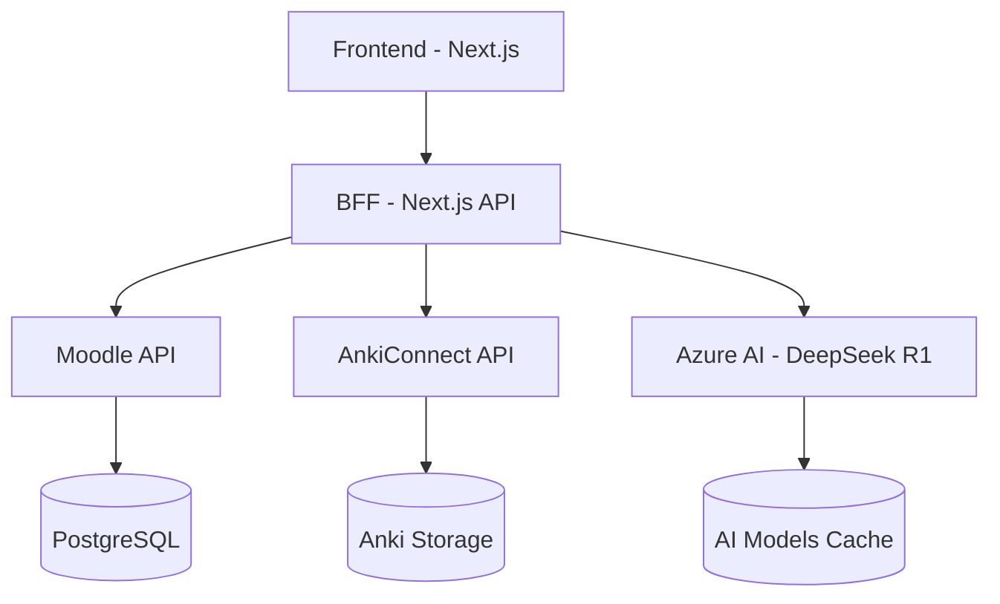

# Optimización del Aprendizaje mediante la Integración de Moodle y NextJs: Un Caso de Estudio sobre el Efecto Dunning-Kruger y Aprendizaje Adaptativo basado en IA

# Abstract

El efecto Dunning-Kruger, donde los estudiantes sobreestiman su dominio de conceptos, representa uno de los mayores obstáculos en la educación moderna. Esta sobreconfianza no solo afecta el proceso de aprendizaje, sino que también perpetúa patrones de estudio ineficientes. Para abordar este desafío, desarrollamos un sistema innovador que combina análisis de datos educativos con inteligencia artificial.

Nuestra solución integra datos de rendimiento de Anki (porcentajes de error en pruebas) con modelos de IA (DeepSeek) para generar recursos educativos personalizados. Implementada como una plataforma NextJs que se integra con Moodle, el sistema crea automáticamente planes de estudio adaptativos y contenido pedagógico basado en el rendimiento real del estudiante. Los resultados demuestran que esta combinación de repaso espaciado, IA y gestión de aprendizaje tradicional optimiza significativamente la retroalimentación educativa, ayudando a cerrar la brecha entre la percepción del estudiante y su dominio real de los conceptos.

# Introducción

La **sobreconfianza** en el dominio de conceptos educativos es un fenómeno ampliamente estudiado en la psicología cognitiva. Este sesgo, conocido como **efecto Dunning-Kruger (1)**, se refiere a la tendencia de individuos con habilidades o conocimientos limitados a sobrestimar sus competencias, mientras que aquellos más competentes tienden a subestimarse. La sobreconfianza (Dunning-Kruger) no solo distorsiona la autoevaluación, sino que incentiva estrategias superficiales como la memorización mecánica (Smith et al., 2020)".

Por otra parte Hermann Ebbinghaus (1885) demostro que la memoria declina exponencialmente en el tiempo, pero puede ser reforzada al repasar información antes de que se olvide por completo, conocido como **memorización espaciada.** Esta técnica es la que utiliza el software de flashcards Anki utilizando el modelo de memoria espaciada SM-2 desarrollado por Piotr Wozniak

$$
I_n=I_{(n−1)}×EF

$$

$$
\begin{aligned}I_n=\text{El próximo intervalo de  repetición}.\end{aligned}

$$

$$
\begin{aligned}EF: \text{El factor de facilidad, que se ajusta según la calidad de la respuesta (entre 0-5).}\end{aligned}

$$

| Calificación Constante | Repaso 1 | Repaso 2 | Repaso 3 | Repaso 4 | Repaso 5 | Repaso 6 | Repaso7 |
| ------------------------- | ---------- | ---------- | ---------- | ---------- | ---------- | ---------- | --------- |
| 1                       | 1        | 2        | 3        | 4        | 5        | 6        | 7       |
| 2                       | 1        | 2        | 3        | 4        | 5        | 6        | 7       |
| 3                       | 1        | 2        | 8        | 21       | 53       | 135      | 344     |
| 4                       | 1        | 2        | 9        | 25       | 65       | 169      | 439     |
| 5                       | 1        | 2        | 10       | 28       | 78       | 218      | 610     |

*"Los intervalos para calificaciones ≥3 siguen una progresión geométrica (EF = 2.5 inicial), mientras que calificaciones ≤2 reinician el ciclo"*.

Sin embargo, el uso de herramientas para el autoaprendizaje también puede traer grandes retos, por ejemplo, para Anki identificamos los siguientes (3, 4):

- Inconsistencias en el uso
- **Memorización sin comprensión**
- Sobrecarga cognitiva
- Estancamiento conceptual

En este documento nos centramos en el problema de La memorización sin comprensión (Anki) y como limita la transferencia de conocimiento, coincidiendo con lo observado por Karpicke & Blunt (2011) en métodos basados puramente en repetición.

Para la solución desarrollada nos centramos principalmente en el artículo de **Sloan y Scharff (2022) que** analiza cómo las autoevaluaciones de los estudiantes pueden ser herramientas efectivas para mejorar el aprendizaje y la metacognición (saber lo que sabes y lo que  no). En el artículo se centraron específicamente en las encuestas de conocimiento (Knowledge Surveys, KS), una forma de autoevaluación donde los estudiantes califican su habilidad para responder una pregunta o realizar una tarea, en lugar de resolver directamente un problema. En el documento también se menciona que las autoevaluaciones no solo benefician el desempeño, sino que ayudan a que se definan objetivos de aprendizaje.

Este punto es retomado en Schendel (2019) donde menciona que "exam wrappers" (actividades de reflexión posteriores) ayudan a reconocer errores y a ajustar métodos de estudio.

# Objective

El objetivo principal es desarrollar un sistema integrado que optimice el proceso de aprendizaje mediante la conexión entre Anki y Moodle, aprovechando la inteligencia artificial. El sistema:

1. Analiza el rendimiento del estudiante en Anki, identificando patrones de error y conceptos problemáticos
2. Utiliza modelos de IA (DeepSeek y OpenAI) para:
   - Generar contenido educativo personalizado
   - Crear planes de estudio adaptativos
   - Diseñar actividades de refuerzo específicas
3. Integra automáticamente estos recursos en Moodle como:
   - Materiales de estudio
   - Tareas personalizadas
   - Actividades de evaluación

Esta integración busca cerrar la brecha entre la percepción del estudiante sobre su dominio de los conceptos y su comprensión real, utilizando datos objetivos de rendimiento para guiar el proceso de aprendizaje.

# Development: Uplearn

## Arquitectura del Sistema

El sistema Uplearn está diseñado con una arquitectura moderna de microservicios, implementada en contenedores Docker para garantizar la portabilidad y facilitar el despliegue. La arquitectura se divide en cuatro componentes principales:

1. **Frontend (Next.js)**: Interfaz de usuario moderna y reactiva
2. **Backend-for-Frontend (Next.js API)**: Capa de orquestación y transformación de datos
3. **LMS Backend (Moodle)**: Sistema de gestión de aprendizaje
4. **Integración con Anki**: Sistema de repaso espaciado

El Backend-for-Frontend (BFF) implementado en Next.js actúa como una capa de abstracción que:

- Orquesta las llamadas a múltiples servicios (Moodle, Anki, Azure AI)
- Transforma y adapta los datos para el consumo del frontend
- Gestiona la integración con Azure AI utilizando el modelo DeepSeek R1 para:
  - Generación de contenido educativo personalizado
  - Optimización de rutas de aprendizaje
  - Análisis de patrones de estudio

## Stack Tecnológico

### Frontend (Next.js)

Se eligió Next.js 14 como framework principal por las siguientes razones:

- **Server Components**: Mejora significativa en el rendimiento y SEO
- **App Router**: Enrutamiento más intuitivo y mejor manejo de layouts
- **API Routes**: Facilita la integración con backends múltiples

Componentes principales:

- **UI**: Shadcn (basado en Tailwind CSS) - Elegido por su accesibilidad y personalización
- **Estado**: Zustand - Seleccionado por su simplicidad y rendimiento superior a Redux
- **Fetching**: React Query - Manejo óptimo de cache y estados de carga
- **Monitoreo**: Sentry - Implementado para seguimiento de errores en tiempo real y monitoreo de rendimiento, crucial para:
  - Detección temprana de problemas en producción
  - Análisis de impacto en la experiencia del usuario
  - Optimización del rendimiento de la aplicación
  - Seguimiento de errores en la integración con Moodle y AnkiConnect

### Backend (Moodle)

Moodle fue configurado con las siguientes optimizaciones:

- **Base de Datos**: PostgreSQL en lugar de MySQL por mejor rendimiento y características avanzadas
- **API**: Habilitación de servicios web REST con autenticación token
- **Automatización**: Scripts Python para provisión inicial de cursos y configuraciones

La integración con Moodle requirió un enfoque en dos fases para la gestión de API:

1. **Fase Inicial: Plugin Externo**
   - Inicialmente se implementó un plugin de terceros para exponer la API básica de Moodle
   - Esta solución permitió un acceso inicial a las funcionalidades core
   - Sin embargo, se identificaron limitaciones en términos de:
     - Operaciones atómicas complejas
     - Validaciones específicas del negocio
     - Optimización de consultas

2. **Fase de Optimización: Plugin Personalizado (tnadvancemanage)**
   - Se desarrolló un plugin propio para superar las limitaciones identificadas
   - Características principales:
     - APIs optimizadas para operaciones frecuentes (Page, Quiz, Glossary, Database)
     - Validaciones robustas integradas
     - Operaciones atómicas para mantener consistencia de datos
     - Abstracción de la complejidad de las relaciones en Moodle

Esta estrategia de dos fases permitió:
- Inicio rápido del desarrollo con el plugin de terceros
- Optimización progresiva mediante el plugin personalizado
- Mayor control sobre la integración y el rendimiento

### Integración con Anki

La integración con Anki presenta desafíos técnicos importantes que requirieron soluciones específicas:

- **Limitación**: AnkiWeb no proporciona API pública
  - La plataforma web oficial de Anki no expone endpoints públicos para integración
  - Las solicitudes de API requieren autenticación propietaria
  - La documentación oficial no contempla integraciones de terceros

- **Solución**: Implementación de AnkiConnect para API REST local
  - Desarrollo de un middleware basado en AnkiConnect
  - Implementación de endpoints REST para:
    - Sincronización de mazos y tarjetas
    - Obtención de estadísticas de estudio
    - Análisis de patrones de error
  - Arquitectura de comunicación local mediante WebSocket
  - Sistema de caché para optimizar consultas frecuentes

- **Fallback**: Sistema de datos simulados para demostraciones en la nube
  - Implementación de un servicio de emulación de Anki
  - Generación de datos sintéticos basados en patrones reales
  - Sistema de cache distribuido para mantener consistencia
  - Mecanismo de sincronización bidireccional

Esta arquitectura de integración permite:

1. **Operación Local Robusta**
   - Comunicación directa con la instancia local de Anki
   - Bajo latencia en operaciones frecuentes
   - Manejo eficiente de grandes volúmenes de datos

2. **Compatibilidad Cloud**
   - Funcionamiento sin dependencia de instalación local
   - Experiencia consistente en entornos cloud
   - Escalabilidad horizontal del sistema fallback

3. **Manejo de Errores Resiliente**
   - Detección automática de disponibilidad de Anki
   - Cambio transparente entre modos local y fallback
   - Recuperación automática de conexión

## Decisiones de Implementación

1. **Containerización**: Docker para garantizar consistencia entre entornos
2. **API Gateway**: Implementado para unificar acceso a Moodle y AnkiConnect

Esta arquitectura permite:

- Escalabilidad horizontal
- Mantenimiento simplificado
- Integración continua eficiente
- Desarrollo independiente de componentes
- Testabilidad mejorada
- Aislamiento de dependencias externas
